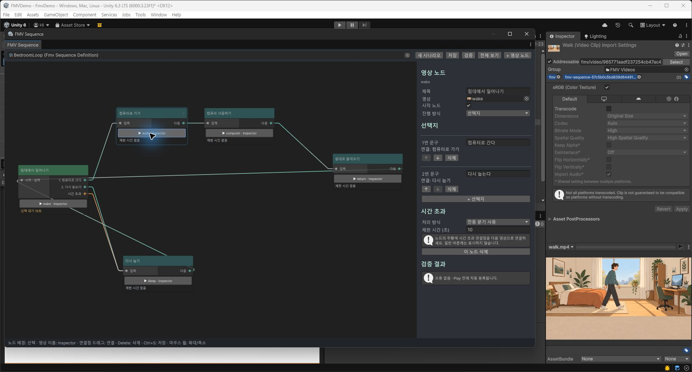
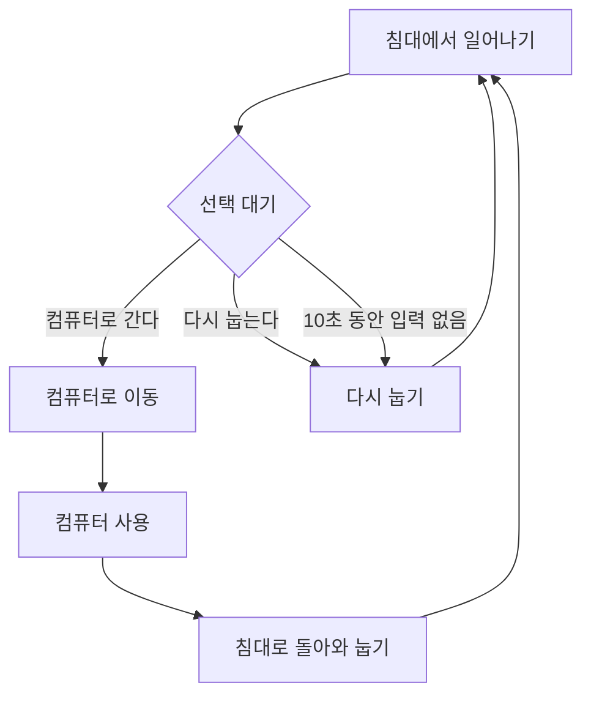
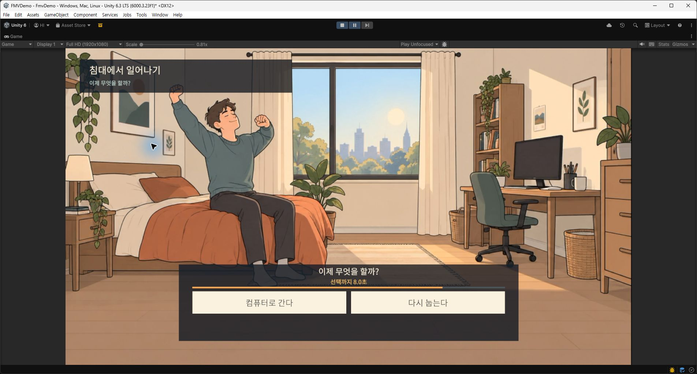
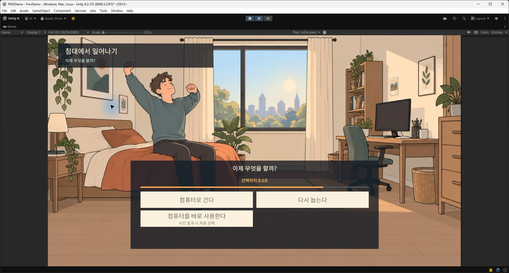

# FMV 시나리오 편집기

## 열기와 영상 선택

`Tools > FMV > Sequence Editor`, 시나리오 에셋 더블클릭, 시나리오 Inspector의 편집 버튼으로 연다. 상단 선택기에서 시나리오를 전환하고 **새 시나리오**로 `Assets/FMV/Content` 아래에 생성한다. 실제 시작 시나리오는 `Assets/FMV/Settings/FmvRuntimeSettings.asset`에서 지정한다.

노드 배경을 클릭하면 오른쪽에 제목·영상·시작점·진행 방식·선택지·제한 시간 설정이 나타난다. 영상 필드에는 Project의 VideoClip을 끌어 넣거나 선택기를 사용한다.

노드 안의 **▶ 영상 이름 · Inspector**를 한 번 클릭하면 해당 VideoClip이 Inspector에 선택되고 Project 창에서 강조된다. 그래프의 시나리오, 화면 위치와 편집 중인 노드는 유지된다. Inspector가 잠겨 있으면 Unity 기본 잠금 동작을 따른다. 영상이 이동해도 GUID로 찾아가며, 누락되면 버튼을 비활성화한다. Play 중에도 영상 선택은 가능하다.

## 오른쪽 아래 영상 미리보기

노드 편집 패널 아래에 작은 **영상 미리보기**를 추가했다. 위쪽 설정을 스크롤해도 미리보기 영역은 하단에 유지된다.

1. 영상이 지정된 노드를 선택한다.
2. 오른쪽 아래 **재생**을 누르면 해당 영상을 비율을 유지해 반복 재생한다. 게임 Play 모드에 들어갈 필요는 없다.
3. **일시정지**로 멈추고 **재생**으로 이어 보거나, **처음부터**로 다시 재생한다.

다른 영상을 가진 노드로 바꾸면 이전 미리보기를 정리한다. 같은 영상을 공유하는 노드는 재생을 유지한다. 영상이 없으면 버튼이 비활성화된다. 창 닫기·재컴파일·Play 모드 전환 시 미리보기 자원을 정리한다. 준비에 실패하면 안내를 표시하며 재생 버튼으로 다시 시도할 수 있다.

이 영역은 현재 선택한 노드의 영상 한 편을 확인하는 용도다. 분기·시간 초과·Addressables 재생은 Game 뷰에서 확인한다. 노드 안의 영상 이름 클릭은 기존대로 Inspector 선택을 수행하며 오른쪽에서 편집 중인 노드는 바꾸지 않는다.

미리보기는 Unity 내부의 Editor 영상 API를 별도 코드로 감싸 사용한다. Unity 버전을 변경할 때 재생 호환성을 다시 확인해야 한다. 현재는 컴파일과 패널 생성까지 확인했으며 실제 재생·일시정지 버튼의 화면 검증은 남아 있다.

## 침실 데모 흐름

## 노드와 연결

- 상단 **+ 영상 노드** 또는 그래프 우클릭 메뉴로 노드를 추가한다. 새 ID를 자동 생성하며 기존 ID는 바꾸지 않는다.
- 노드 제목 영역을 끌어 위치를 바꾼다. 휠로 확대·축소하고 배경을 가운데 버튼으로 끌어 이동한다. **전체 보기**는 모든 노드를 화면에 맞춘다.
- 오른쪽 출력점에서 대상 노드의 왼쪽 입력점으로 끌어 연결한다. 출력점마다 대상 하나, 입력점에는 여러 연결을 허용한다. 루프와 자기 자신 연결도 가능하다.
- 자동 진행 노드는 **다음** 출력점을 사용한다. 미연결이면 해당 영상에서 재생을 마친다.
- 선택지 노드는 문구별 출력점을 사용한다. 오른쪽에서 문구를 편집하고 ↑/↓로 순서를 바꾼다.
- 연결선 또는 노드를 선택하고 Delete로 삭제한다. 노드는 오른쪽 삭제 버튼도 제공한다.

노드를 삭제하면 유입 연결을 비우고 선택지 문구는 보존한다. 시작점이나 시간 초과 대상이 없어져도 다른 노드를 대신 지정하지 않는다. 진행 방식을 바꾸면 이전 방식의 연결과 선택지를 정리한다. Undo로 복구할 수 있다.

## 시간 초과 설정

일반 선택지가 있는 노드에서만 사용할 수 있다. 새 노드는 **사용 안 함**이 기본이며 활성화 시 기본 제한 시간은 10초다.

| 방식 | 편집 | 게임 화면 |
|---|---|---|
| 사용 안 함 | 추가 설정 없음 | 제한 없이 선택 대기 |
| 일반 선택지 사용 | 선택지 중 정확히 하나의 자동 대상 체크 | 그래프에 `[자동]`, 버튼에 `시간 초과 시 자동 선택` 표시, 직접 클릭도 가능 |
| 전용 분기 사용 | 주황색 **시간 초과** 출력점을 대상에 연결 | 별도 선택지 버튼을 만들지 않고 만료 시 전환 |

침실 데모는 일어나는 영상이 끝난 뒤 10초 동안 기다리고, 입력이 없으면 전용 분기로 다시 눕는 영상을 재생한다. 수동 선택은 기존 두 버튼을 사용한다.

게임 화면에 남은 시간과 감소하는 막대를 표시한다. 카운트다운은 영상 종료 후 선택 대기에 들어갈 때 시작하며 로딩·준비·영상 재생 시간은 포함하지 않는다. `Time.timeScale`과 무관하게 진행하고 Editor Pause에서는 정지한다. 수동 클릭과 만료가 겹치면 먼저 확정한 전환 한 번만 처리한다.

재시작·정지·오류·노드 전환 시 타이머를 해제하고 같은 노드에 다시 들어오면 전체 시간으로 시작한다. 일반 선택지 자동 지정은 선택지 자체에 저장하므로 순서 변경에도 유지된다. 자동 대상을 삭제하면 새 대상을 직접 지정해야 한다.

선택지 버튼은 데이터 수만큼 재사용·생성한다. 세 개 이상도 표시하며 표시 영역을 넘으면 스크롤한다.

## 시나리오 데이터와 영상 교체

원본 데이터는 `FmvSequenceDefinition` ScriptableObject다. 그래프에서 편집한 내용이 아래 필드에 저장된다.

| 필드 | 용도 |
|---|---|
| Start Node Id | 시작할 노드 |
| Id / Title | 고유 노드 ID / 화면 제목 |
| Video | 재생할 VideoClip의 Addressables 참조 |
| Next Node Id | 영상 종료 후 자동으로 이동할 노드 |
| Choices | 선택지 문구와 이동할 노드 ID |
| Timeout Mode / Choice Timeout Seconds | 시간 초과 방식 / 선택 대기 제한 시간 |
| Timeout Target Node Id / Is Timeout Default | 전용 분기 대상 / 일반 선택지의 자동 대상 표시 |

`Next Node Id`와 `Choices`는 동시에 지정하지 않는다. 둘 다 비워 두면 해당 영상에서 끝난다. 루프는 허용한다. 새 시나리오도 `Assets/FMV/Content` 아래에 저장한다. 시작 시나리오는 `Assets/FMV/Settings/FmvRuntimeSettings.asset`에서 선택한다.

실사 영상을 넣는 방법은 두 가지다.

- 기존 MP4를 같은 경로에서 교체하면서 `.meta` 파일을 유지한다.
- 새 영상을 Assets에 가져온 뒤 노드의 Video 참조를 교체한다.

영상의 Addressable 체크·그룹·라벨을 손으로 관리할 필요는 없다. Play 진입과 콘텐츠 빌드 전에 시나리오가 참조하는 영상을 자동 등록한다. 제목과 선택지는 한국어 Noto CJK 글꼴을 사용한다.

권장 영상 형식은 H.264 MP4, yuv420p, 일정한 프레임 속도다. 현재 영상은 같은 실사풍 인물이 실제로 움직이는 Gemini 생성 영상이며 1280×720, 30fps, 무음이다. 네 장면은 각 10초, 다시 눕기는 복귀 영상의 마지막 4.5초를 사용한다. 제작 원본과 편집 기준은 [영상 제작 기록](../SourceArt/PhotorealDemo/generation-brief.md)에 있다. 음성이 포함된 영상은 첫 오디오 트랙을 AudioSource로 출력한다. 표시 영역은 16:9이고 다른 비율의 영상은 비율을 유지해 맞춘다.

## 저장과 검증

편집은 메모리의 시나리오 에셋에 즉시 반영한다. **저장**, Ctrl+S, 창 닫기, 재컴파일, Play·콘텐츠 빌드 진입 시 디스크에 저장한다. 데이터 편집과 배치에 Undo/Redo를 지원한다. Play 중 그래프 편집은 잠긴다.

원본 데이터는 `FmvSequenceDefinition`이다. 위치는 `Assets/FMV/Editor/GraphLayouts/<시나리오 GUID>.asset`에 별도 저장한다. 배치 변경은 콘텐츠 지문에 영향을 주지 않지만 영상·문구·연결·제한 시간 변경은 번들 재빌드 대상이다. 창 재열기 시 노드 배치를 복구하고, 재컴파일 시 열린 창의 시나리오·선택·화면 위치도 복구한다.

불완전한 시나리오도 편집·저장할 수 있다. 오른쪽 검증 결과에 누락 영상·시작점·대상 연결, 중복 ID, 빈 문구, 유효하지 않은 시간, 자동 대상 누락·중복을 표시한다. 오류 버튼을 누르면 해당 노드로 이동한다. 도달할 수 없는 노드는 경고다. 일반적인 루프는 오류가 아니다. 오류가 남으면 기존 Play·빌드 검증이 실행을 차단한다.

새 영상의 Addressables 주소·그룹·라벨은 기존 Play·빌드 전처리에서 자동 등록한다. 별도 수동 등록은 필요하지 않다.

## 확장 지점

`FmvSequenceEditService`가 데이터 수정, 연결, 자동 지정, 영상 선택, 검증, 저장을 담당한다. `FmvSequenceEditor`는 GraphView 화면과 입력을 담당한다. 실험 API인 GraphView는 Editor 화면 코드에만 사용한다. 외부 프로그램 연동과 가져오기·내보내기는 이 버전에 포함하지 않는다.

`FmvPlayer.Choose(int)` 등 기존 재생 호출은 유지한다. UI는 `IsChoiceTimed`, `ChoiceTimeRemaining`, 현재 노드의 제한 시간을 읽는다. 카운트다운 값은 프레임마다 갱신되며 `Changed` 이벤트는 상태·노드 변화 알림에 사용한다.
